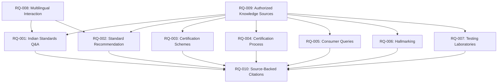

# Problem Statement Requirements Traceability Matrix

**Document Version**: 1.1  
**Phase**: Phase 1 — SIH PS Requirements & System Scope  
**Purpose**: Map all explicit SIH Problem Statement requirements to system components, knowledge domains, and verification test suites.

---

## 1. Traceability Matrix

| Requirement ID | Requirement Title | Source Basis | Knowledge Domain | System Components | Primary Architecture Layer | Verification Suite | Acceptance / Target Criterion |
|---|---|:---:|---|---|---|---|---|
| **RQ-001** | Answer Indian Standards Questions | `PS_EXPLICIT` | `KD-001` (Indian Standards) | `StandardsRegistry`, `StructureParser`, `UnifiedHybridRetriever` | Retrieval & QA Engine | `tests/test_rag_pipeline.py` | 100% correct clause, specification, and numerical limit retrieval on test queries. |
| **RQ-002** | Recommend Applicable Standards | `PS_EXPLICIT` | `KD-001` (Indian Standards) | `ProductResolver`, `QueryUnderstandingEngine`, `ProductRegistry` | Product & Query Understanding | `tests/test_product_resolver_v6.py` | $\ge 95\%$ accuracy on conversational and synonym product queries. |
| **RQ-003** | Certification Scheme Guidance | `PS_EXPLICIT` | `KD-002` (Certification) | `SchemeRegistry`, `QCORegistry`, `CertificationChainReasoner` | Reasoning & Scheme Layer | `tests/test_certification_chain_v5.py` | 100% correct classification of Scheme-I, II, IV and mandatory QCO status. |
| **RQ-004** | Explain Certification Processes | `PS_EXPLICIT` | `KD-002` (Certification) | `ProductManualRegistry`, `SITRegistry`, `LicenceRegistry` | Workflow & Process Layer | `tests/test_batch_c_product_manuals_sit.py` | Correct extraction of application steps, factory test frequencies, and audit rules. |
| **RQ-005** | Answer Consumer Queries | `PS_EXPLICIT` | `KD-005` (Consumer Info) | `ConsumerRegistry`, `LicenceRegistry`, `HallmarkRegistry` | Consumer Protection Layer | `tests/test_batch_d_laboratories_licences_crs.py` | Accurate CM/L, R-number, and HUID verification workflows and BIS Care guidance. |
| **RQ-006** | Hallmarking Guidance | `PS_EXPLICIT` | `KD-004` (Hallmarking) | `HallmarkRegistry`, `CertificationChainReasoner` | Hallmarking Engine | `tests/test_hallmarking_registry.py` | 100% accurate guidance on gold/silver purity, 6-digit HUID, and AHC centers. |
| **RQ-007** | Suggest Testing Laboratories | `PS_EXPLICIT` | `KD-003` (Testing & Labs) | `LaboratoryRegistry`, `TestRegistry` | Laboratory & Test Layer | `tests/test_batch_d_laboratories_licences_crs.py` | Correct identification of accredited BIS and partner labs for given standard codes. |
| **RQ-008** | Multilingual Interaction | `PS_EXPLICIT` | `KD-006` (General Services) | `MultilingualQueryLayer`, `QueryUnderstandingEngine` | Multilingual NLP Layer | Phase 10 Multilingual Suite | Accurate intent and entity preservation in Hindi and regional language queries. |
| **RQ-009** | Grounding in Authorized Sources | `PS_EXPLICIT` | `KD-001` to `KD-006` | `SourceRegistry`, `EvidenceRegistry`, `RegulatorySafetyLayer` | Provenance & Evidence Layer | `tests/test_source_registry_v4.py` | 100% of factual answers derived from verified primary/secondary authoritative records. |
| **RQ-010** | Source-Backed Responses & Citations | `PS_EXPLICIT` | `KD-001` to `KD-006` | `StandardizedCitationFormatter`, `EvidenceRegistry` | Citation & Grounding Layer | `tests/test_citation_formatter.py` | Every response contains granular document, standard edition, and clause citations. |

---

## 2. Requirements Dependency Graph

