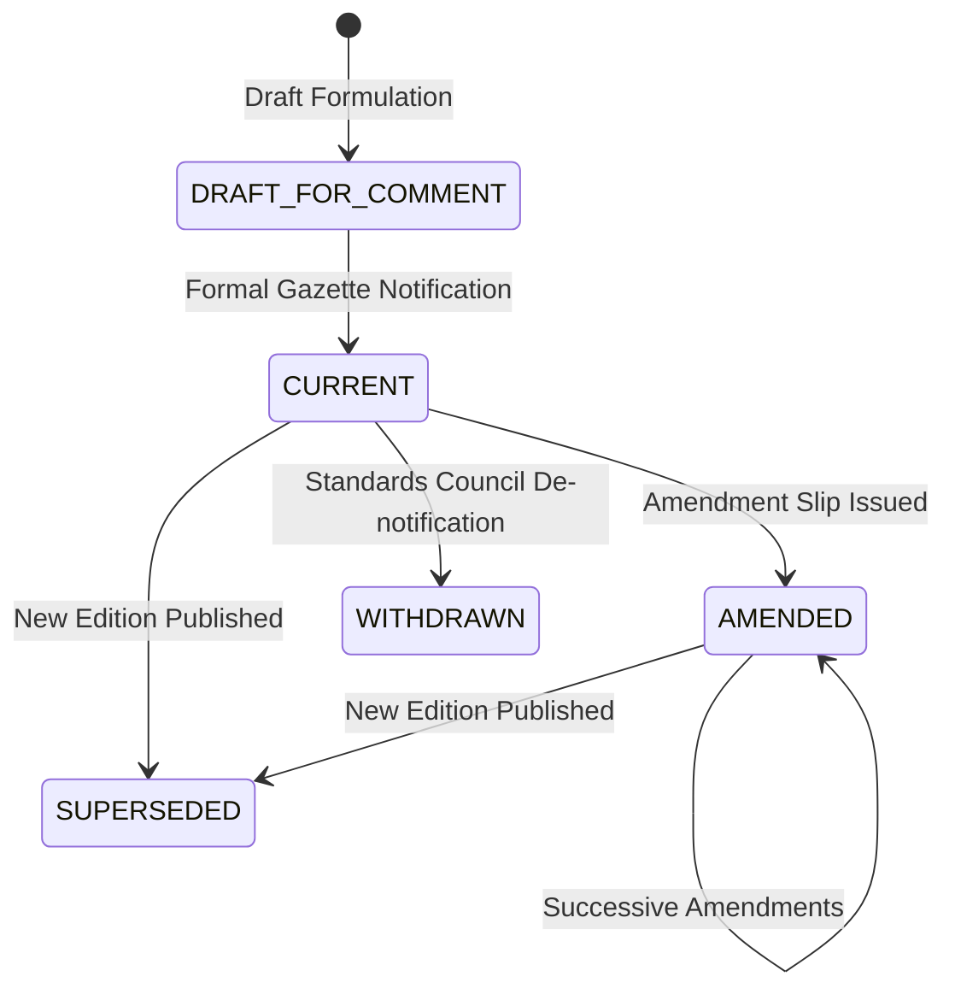

# Source Versioning & Temporal Identity Policy

**Document Version**: 1.1  
**Phase**: Phase 2 — BIS Authorized Knowledge-Source Architecture  
**Scope**: Deterministic Structured Identity, Amendment Linking, Supersession, and Hash Review Rules  

---

## 1. Identity vs Content Hash Principle

```
┌────────────────────────────────────────────────────────────────────────────┐
│ 1. Document Identity (document_id): WHAT statutory entity is this?         │
│    - Deterministic, human-readable, schema-governed (e.g. IS-1786-2008).  │
│    - Structured components: family_id, standard_no, part, edition_year.   │
├────────────────────────────────────────────────────────────────────────────┤
│ 2. Content Hash (sha256): WHICH EXACT BYTE PAYLOAD did we retrieve?       │
│    - 64-character hex digest of the raw downloaded binary file.           │
└────────────────────────────────────────────────────────────────────────────┘
```

---

## 2. Structured Identity Models

To prevent brittle string-only assumptions, standard identities preserve structured fields alongside canonical strings:

### Standard Specifications
- `document_family_id`: Base series identifier (e.g. `IS-1786`, `IS-16046`, `IS-302`)
- `standard_number`: Number code (e.g. `"1786"`, `"16046"`)
- `part`: Optional part number (e.g. `"1"`, `"2"`, `"2-1"`)
- `edition_year`: Integer publication year (e.g. `2008`, `2018`)
- `canonical_id`: `IS-{standard_number}{part_suffix}-{edition_year}` (e.g. `IS-1786-2008`, `IS-16046-P2-2018`)

### Amendments & Errata
- `parent_document_id`: Parent standard ID (e.g. `IS-1786-2008`)
- `amendment_number`: Integer index (e.g. `1`, `2`)
- `canonical_id`: `IS-{standard_number}{part_suffix}-{edition_year}-A{amendment_number}` (e.g. `IS-1786-2008-A1`)

### Gazette Quality Control Orders
- `ministry_acronym`: Issuing ministry (e.g. `DPIIT`, `MEITY`, `MOEFCC`, `MOS`)
- `notification_number`: S.O. number (e.g. `SO1245E`)
- `year`: Integer gazette year (e.g. `2023`)
- `canonical_id`: `QCO-{ministry_acronym}-{notification_number}-{year}` (e.g. `QCO-DPIIT-SO1245E-2023`)

---

## 3. Version Lifecycle States



- **`CURRENT`**: Fully in force without outstanding modifications.
- **`AMENDED`**: In force with one or more active amendment slips attached.
- **`SUPERSEDED`**: Replaced by a newer edition (e.g. IS 374:1979 superseded by IS 374:2019).
- **`WITHDRAWN`**: Standard or order formally de-notified and revoked.

---

## 4. Hash Mutation & Version Review Policy

When a source endpoint is rescanned during continuous updates:

1. **Same `document_id` + Same `sha256`**:
   $$\longrightarrow \text{UNCHANGED\_DOCUMENT}$$
   No re-extraction or index mutation required.

2. **Same `document_id` + Different `sha256`**:
   $$\longrightarrow \text{CONTENT\_CHANGED\_REQUIRES\_VERSION\_REVIEW}$$
   A changed hash does **not** automatically prove a new statutory revision. The change may represent a PDF rescanning, typo erratum, or consolidation. The document enters the Version Review Queue where extracted metadata is compared to determine whether it is an erratum, amendment, or replacement.

3. **Different `document_id` + Same `sha256`**:
   $$\longrightarrow \text{DUPLICATE\_REPRESENTATION\_ALIAS}$$
   Cross-referenced in provenance ledger without creating redundant vector chunks.

4. **Different `document_id` + Different `sha256`**:
   $$\longrightarrow \text{DISTINCT\_DOCUMENTS}$$
