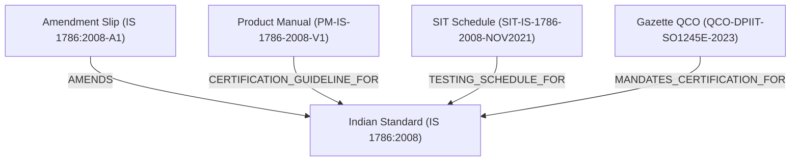

# Discovered Relationship Specification (Phase 3F)

**Document Version**: 1.0  
**Phase**: Phase 3 — Bulk BIS Data Discovery & Acquisition  
**Scope**: Formal Relationship Models Between Standards, Amendments, Manuals, SIT, and QCOs  

---

## 1. Explicit Relationship Types

Relationships between discovered entities are established only through explicit document linkages and authoritative metadata, never through filename guessing:

---

## 2. Relationship Schema

Each relationship entry in `data/acquisition/manifests/acquisition_manifest.json` contains:
- `source_document_id`: Origin document ID (e.g. `IS-1786-2008-A1`)
- `target_document_id`: Target document ID (e.g. `IS-1786-2008`)
- `relationship_type`: Formal enum code (`AMENDS`, `CERTIFICATION_GUIDELINE_FOR`, `TESTING_SCHEDULE_FOR`, `MANDATES_CERTIFICATION_FOR`)
- `confidence`: $1.0$ (deterministic binding)
- `discovered_via`: Source endpoint ID (e.g. `SRC-003`)
- `provenance_metadata`: Additional context (edition year, ministry, etc.)
